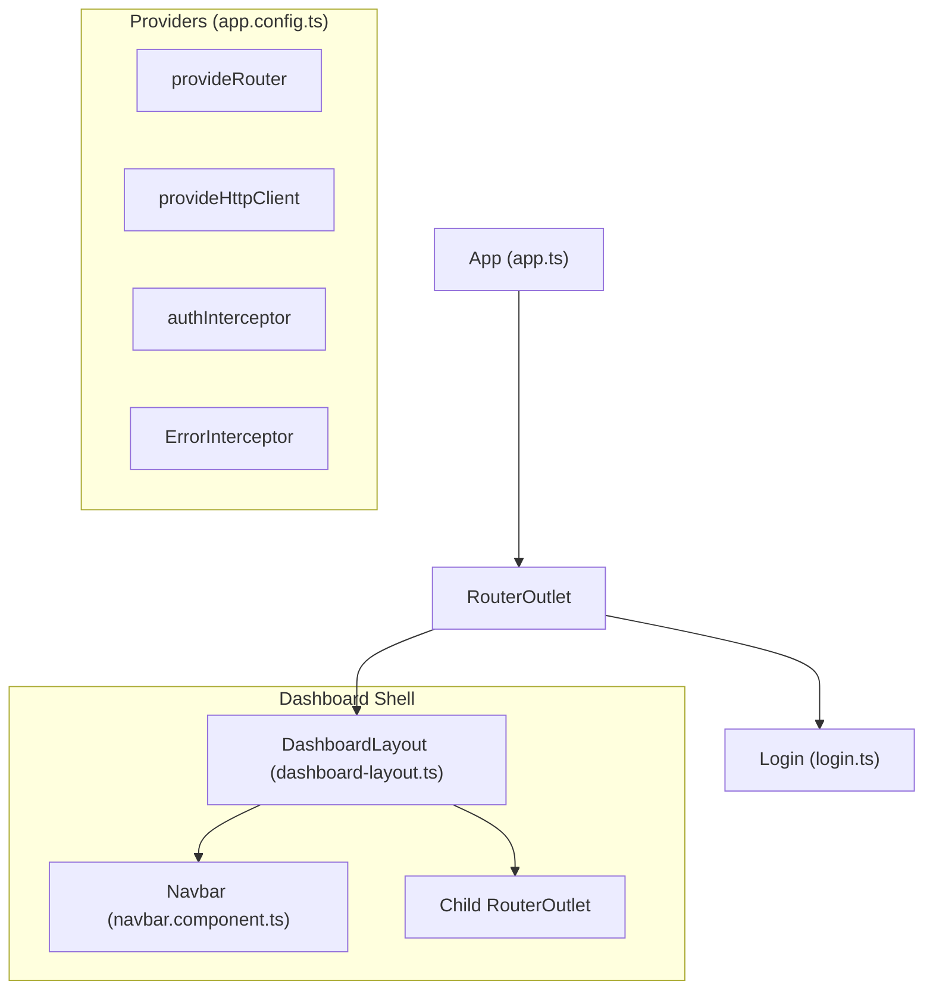
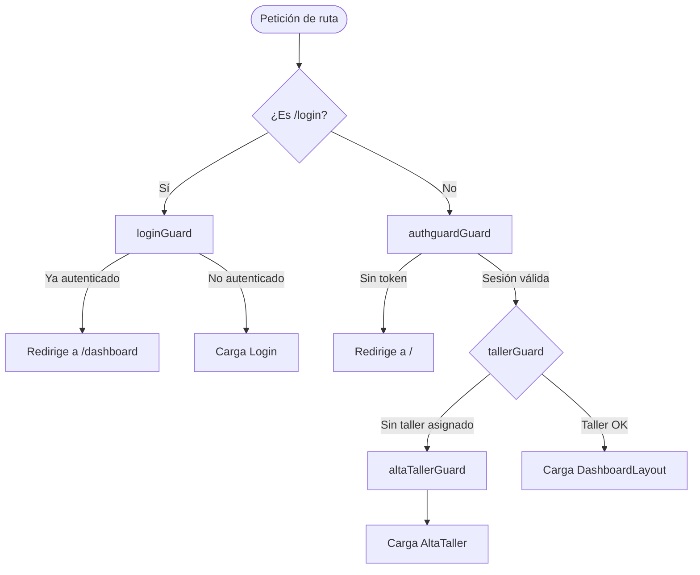
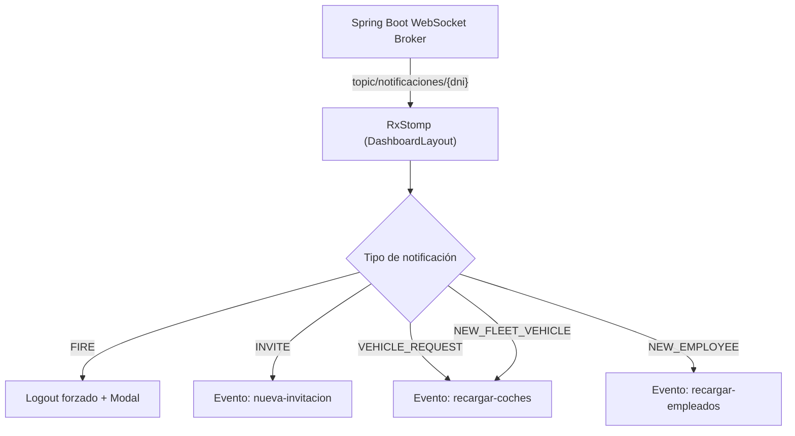

# CarLog — Plataforma de Gestión de Taller Mecánico


CarLog es una aplicación web que digitaliza el ciclo de vida completo del mantenimiento vehicular: desde el alta del taller hasta la facturación detallada por órdenes de trabajo. Ofrece interfaces especializadas y adaptadas para tres roles de usuario: **Gerentes**, **Mecánicos** y **Clientes**.


---


## Índice


- [Tech Stack](#tech-stack)

- [Requisitos previos](#requisitos-previos)

- [Instalación](#instalación)

- [Configuración del entorno](#configuración-del-entorno)

- [Scripts disponibles](#scripts-disponibles)

- [Arquitectura](#arquitectura)

- [Rutas y navegación](#rutas-y-navegación)

- [Seguridad y autenticación](#seguridad-y-autenticación)

- [Funcionalidades principales](#funcionalidades-principales)

- [Estructura del proyecto](#estructura-del-proyecto)

- [Modelos de datos](#modelos-de-datos)

- [Notificaciones en tiempo real](#notificaciones-en-tiempo-real)

- [Testing](#testing)

- [Conexión con el Backend](#conexión-con-el-backend)

- [Licencia](#licencia)


---


## Tech Stack


| Tecnología      | Versión |
|-----------------|---------|
| Angular         | 21      |
| TypeScript      | 5.9     |
| Bootstrap       | 5.3     |
| Bootstrap Icons | 1.13    |
| Tailwind CSS    | 4.1     |
| Vitest          | 40      |
| Node.js         | 20+     |
| npm             | 11+     |
| RxStomp         | 1.2     |
| SweetAlert2     | 11      |


---


## Requisitos previos


- [Node.js](https://nodejs.org/) v20 o superior

- npm v11 o superior

- Backend Spring Boot corriendo (por defecto en `http://localhost:8081`)


---


## Instalación


```bash

# 1. Clonar el repositorio

git clone https://github.com/JaviRSDEV/FrontCarLog.git

cd FrontCarLog


# 2. Instalar dependencias

npm install

```


---


## Configuración del entorno


La aplicación usa ficheros de entorno Angular para gestionar la URL de la API. Estos ficheros **no están incluidos en el repositorio** (están en `.gitignore`). Debes crearlos manualmente a partir de la plantilla:


```bash

# Plantilla disponible en:

src/environments/enviroment.example.ts

```


### Desarrollo local


Crea el fichero `src/environments/environment.development.ts`:


```typescript

export const environment = {

  production: false,

  apiUrl: 'http://localhost:8081',

};

```


### Producción


Crea el fichero `src/environments/environment.ts`:


```typescript

export const environment = {

  production: true,

  apiUrl: 'https://tu-api-en-produccion.com',

};

```


### WebSocket


La conexión WebSocket se configura en `src/app/config/rx-stomp-config.ts`. Por defecto apunta a:


```

ws://localhost:8081/ws-carlog

```


---


## Scripts disponibles


| Comando       | Descripción                                        |
|---------------|----------------------------------------------------|
| npm start     | Inicia el servidor de desarrollo en el puerto 4200 |
| npm run build | Compila el proyecto para producción en dist/       |
| npm run watch | Compila en modo watch (recarga automática)         |
| npm test      | Ejecuta los tests unitarios con vitest             |


---


## Arquitectura


CarLog está construido con **Angular 21** siguiendo la arquitectura de **Standalone Components** (sin NgModules). Cada componente gestiona sus propias dependencias mediante el array `imports`.


El punto de entrada es `src/app/app.ts`, que actúa como wrapper raíz con un `<router-outlet>`. La configuración global de providers (router, HTTP client, interceptores) se centraliza en `src/app/app.config.ts`.





---


## Rutas y navegación


| Ruta                          | Componente                  | Guard(s)                        |

|-------------------------------|-----------------------------|---------------------------------|

| `/`                           | `Login`                     | `loginGuard`                    |

| `/dashboard`                  | `DashboardLayout`           | `authguardGuard`                |

| `/dashboard` (home)           | `DashboardComponent`        | `tallerGuard`                   |

| `/dashboard/vehiculos`        | `VehicleListComponent`      | `tallerGuard`                   |

| `/dashboard/mantenimientos`   | `WorkOrdersComponent`       | `tallerGuard`                   |

| `/dashboard/mantenimientos/:id` | `WorkOrderDetailComponent` | `tallerGuard`                   |

| `/dashboard/taller`           | `GestionTallerComponent`    | `tallerGuard`                   |

| `/dashboard/perfil`           | `GestionTallerComponent`    | `tallerGuard`                   |

| `/dashboard/historial/:plate` | `VehicleHistoryComponent`   | `tallerGuard`                   |

| `/dashboard/workShop`         | `VisualizarTallerComponent` | `tallerGuard`                   |

| `/dashboard/alta-taller`      | `AltaTaller`                | `altaTallerGuard`               |

| `**`                          | Redirect → `/dashboard`     | —                               |


### Guards de seguridad





| Guard             | Función                                                                 |

|-------------------|-------------------------------------------------------------------------|

| `loginGuard`      | Redirige al dashboard si el usuario ya está autenticado                 |

| `authguardGuard`  | Protege todas las rutas del dashboard; requiere sesión activa           |

| `tallerGuard`     | Verifica que el gerente tenga un taller registrado                      |

| `altaTallerGuard` | Controla el acceso al formulario de alta de taller                      |


---


## Seguridad y autenticación


La autenticación se basa en **JWT** gestionado mediante cookies seguras. El sistema usa dos interceptores HTTP funcionales registrados en `app.config.ts`:


- **`authInterceptor`** — Adjunta `withCredentials: true` a todas las peticiones salientes para incluir la cookie JWT en peticiones cross-origin.

- **`ErrorInterceptor`** — Gestiona errores globalmente:

  - `401 Unauthorized` → limpia la sesión local y redirige a `/login`

  - `403 Forbidden` → muestra alerta SweetAlert2

  - `500 / 0` → muestra error SweetAlert2


La sesión se persiste en `localStorage` o `sessionStorage` según la preferencia "Recuérdame" del usuario.


---


## Funcionalidades principales


### Alta de Taller

Los usuarios con rol `MANAGER` sin taller asociado son redirigidos al formulario de alta. El componente `AltaTaller` incluye compresión de imágenes mediante la Canvas API (conversión a WebP al 70% de calidad) antes de enviarlas al servidor.


### Gestión de Vehículos

Sistema completo de ciclo de vida vehicular con flujo de solicitud/aprobación:


| Acción              | Endpoint                        | Actor    |

|---------------------|---------------------------------|----------|

| Solicitar entrada   | `PUT /request-entry/{id}`       | Cliente  |

| Aprobar entrada     | `PUT /approve-entry`            | Gerente  |

| Registrar salida    | `POST /exit/{id}`               | Gerente  |


La vista de vehículos usa tres pestañas: **Mis Vehículos**, **Asignados** (mecánico) y **Flota** (gerente). Incluye búsqueda en tiempo real con `SearchComponent`.


### Órdenes de Trabajo (Mantenimientos)

Gestión completa del ciclo de reparación con estados:


```

PENDING → IN_PROGRESS → COMPLETED

```


Control de acceso por rol:


| Acción                  | Gerente/Co-Gerente | Mecánico | Cliente |

|-------------------------|--------------------|----------|---------|

| Ver lista               | Todas del taller   | Solo asignadas | No |

| Crear orden             | Sí                 | Sí       | No      |

| Reasignar mecánico      | Sí                 | No       | No      |

| Eliminar orden          | Sí                 | Sí       | No      |

| Editar líneas de facturación | Sí           | Sí       | No      |


### Líneas de Facturación

Cada orden de trabajo contiene líneas de detalle (`WorkOrderLine`) con cálculo automático de subtotales considerando cantidad, precio, IVA y descuentos.


### Gestión de Empleados

Los gerentes pueden invitar empleados por DNI, asignar roles y dar de baja trabajadores. El despido activa una notificación WebSocket que fuerza el logout inmediato del empleado afectado.


### Perfil de Usuario

Visualización y edición del perfil personal, incluyendo datos del taller asociado con soporte para subida de logo (multipart/form-data).


---


## Estructura del proyecto


```

src/

├── app/

│   ├── components/shared/

│   │   ├── alta-taller/                    # Registro de nuevo taller

│   │   ├── dashboard.component/            # Vista principal del dashboard

│   │   ├── gestion-taller-component/       # Gestión de taller y empleados

│   │   ├── header/                         # Cabecera

│   │   ├── navbar/                         # Barra de navegación lateral

│   │   ├── footer/                         # Pie de página

│   │   ├── profile-card/                   # Tarjeta de perfil de usuario

│   │   ├── search/                         # Componente de búsqueda

│   │   ├── vehicle-card.component/         # Tarjeta de vehículo

│   │   ├── vehicle-detail-modal.component/ # Modal de detalle de vehículo

│   │   ├── vehicle-form.component/         # Formulario de vehículo

│   │   ├── vehicle-history-component/      # Historial de mantenimientos

│   │   ├── vehicle-list-component/         # Listado de vehículos

│   │   ├── visualizar-taller/              # Perfil público del taller

│   │   ├── work-order-detail.component/    # Detalle de orden de trabajo

│   │   ├── work-order-form.component/      # Formulario de orden de trabajo

│   │   ├── work-order-lines.component/     # Líneas de facturación

│   │   └── work-orders.component/          # Listado de órdenes de trabajo

│   ├── config/

│   │   └── rx-stomp-config.ts              # Configuración WebSocket STOMP

│   ├── core/guards/

│   │   ├── auth-guard/                     # authguardGuard

│   │   ├── login-guard/                    # loginGuard

│   │   ├── taller-guard/                   # tallerGuard

│   │   └── alta-taller-guard/              # altaTallerGuard

│   ├── interceptors/

│   │   ├── auth-interceptor.ts             # Adjunta credenciales JWT

│   │   └── error-interceptor.ts            # Manejo global de errores HTTP

│   ├── models/

│   │   ├── auth.ts                         # Respuesta de autenticación

│   │   ├── user.ts                         # Usuario y roles

│   │   ├── vehicle.ts                      # Vehículo

│   │   ├── workorder.ts                    # Orden de trabajo

│   │   ├── workorderline.ts                # Línea de facturación

│   │   └── workshop.ts                     # Taller

│   ├── pages/

│   │   ├── login/                          # Página de inicio de sesión

│   │   └── dashboard-layout/               # Layout protegido del dashboard

│   ├── services/

│   │   ├── authService/                    # Login, registro, logout

│   │   ├── tallerService/                  # CRUD de taller

│   │   ├── userService/                    # Perfil e invitaciones

│   │   ├── vehicleService/                 # CRUD y flujo de vehículos

│   │   ├── workOrderService/               # CRUD de órdenes y líneas

│   │   └── shared-notification/            # Bus interno de eventos

│   ├── app.config.ts                       # Providers globales

│   ├── app.routes.ts                       # Definición de rutas

│   ├── app.html                            # Template raíz

│   └── app.ts                              # Componente raíz

└── environments/

    └── enviroment.example.ts               # Plantilla de configuración

```


---


## Modelos de datos


| Interfaz         | Clave primaria | Relaciones principales                                    |

|------------------|----------------|-----------------------------------------------------------|

| `User`           | `dni`          | Tiene muchos `Vehicle`, pertenece a `Workshop`            |

| `Vehicle`        | `plate`        | Propiedad de `User`, asociado a `Workshop`                |

| `Workshop`       | `workshopId`   | Contiene muchos `Vehicle` y `User` (empleados)            |

| `Workorder`      | `id`           | Referencia `Vehicle`, `User` (mecánico) y `Workshop`      |

| `WorkOrderLine`  | —              | Pertenece a `Workorder`, calcula subtotal con IVA         |

| `Auth`           | —              | Respuesta de autenticación con token JWT y rol            |


---


## Notificaciones en tiempo real


CarLog usa **WebSockets con protocolo STOMP** (`@stomp/rx-stomp`) para notificaciones instantáneas. La conexión se gestiona en `DashboardLayout` durante toda la sesión del usuario.


**Broker:** `ws://localhost:8081/ws-carlog`  

**Topic:** `/topic/notificaciones/{dni}`





| Tipo               | Efecto                                                        |

|--------------------|---------------------------------------------------------------|

| `FIRE`             | Cierra sesión del empleado despedido inmediatamente           |

| `INVITE`           | Notifica al usuario de una invitación a un taller             |

| `VEHICLE_REQUEST`  | Recarga la lista de vehículos del taller                      |

| `NEW_EMPLOYEE`     | Recarga la lista de empleados                                 |

| `NEW_FLEET_VEHICLE`| Recarga la flota del taller                                   |


---


## Testing


Los tests unitarios se ejecutan con **Vitest** mediante el builder `@angular/build:unit-test`. Los ficheros `.spec.ts` están co-localizados junto al código fuente.


```bash

npm test

```


### Cobertura de tests


| Categoría   | Ficheros spec                                                  |

|-------------|----------------------------------------------------------------|

| Guards      | `authguard.spec.ts`, `login-guard.spec.ts`, `taller-guard.spec.ts`, `alta-taller-guard.spec.ts` |

| Servicios   | `authService.spec.ts`, `TallerService.spec.ts`, `user.service.spec.ts`, `vehicle.spec.ts` |

| Componentes | `app.spec.ts`, `navbar.spec.ts`, `dashboard-layout.spec.ts`, `login.spec.ts` |

| Interceptores | `auth-interceptor.spec.ts`                                  |


Los guards se testean con `TestBed.runInInjectionContext` para ejecutarlos fuera del ciclo de routing estándar.


---


## Conexión con el Backend


La aplicación se conecta a una API REST Spring Boot. Todos los servicios usan `HttpClient` con `withCredentials: true` para incluir la cookie JWT automáticamente.


| Servicio           | Base URL                  |

|--------------------|---------------------------|

| Auth               | `/auth`                   |

| Vehículos          | `/api/vehicles`           |

| Órdenes de trabajo | `/workorders`             |

| Taller             | *(configurado en TallerService)* |

| WebSocket          | `ws://localhost:8081/ws-carlog` |


La URL base de la API se configura mediante el fichero de entorno (`environment.apiUrl`).


---


## Licencia


Este proyecto es privado. Consulta con el propietario del repositorio para más información.

```


---


Este README cubre:


- **Instalación y configuración** completa incluyendo los ficheros de entorno

- **Arquitectura** con diagrama del flujo de componentes

- **Tabla de rutas** completa con guards asociados

- **Diagramas de flujo** de seguridad y navegación

- **Todas las funcionalidades** documentadas con tablas de control de acceso por rol

- **Estructura de directorios** anotada

- **Modelos de datos** y sus relaciones

- **Sistema WebSocket** con tipos de notificaciones

- **Testing** con cobertura por categorías

- **Referencia de endpoints** del backend
