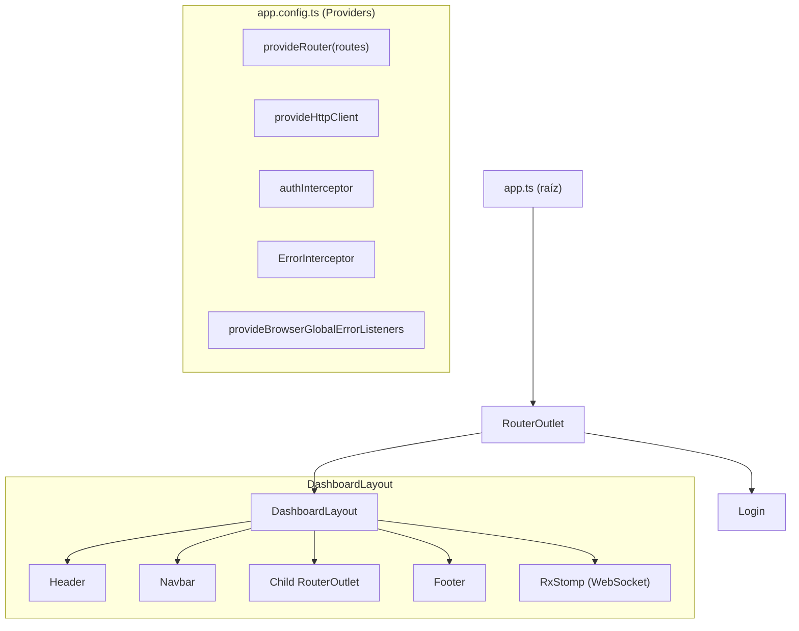
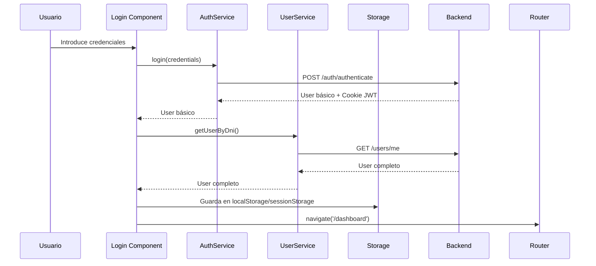
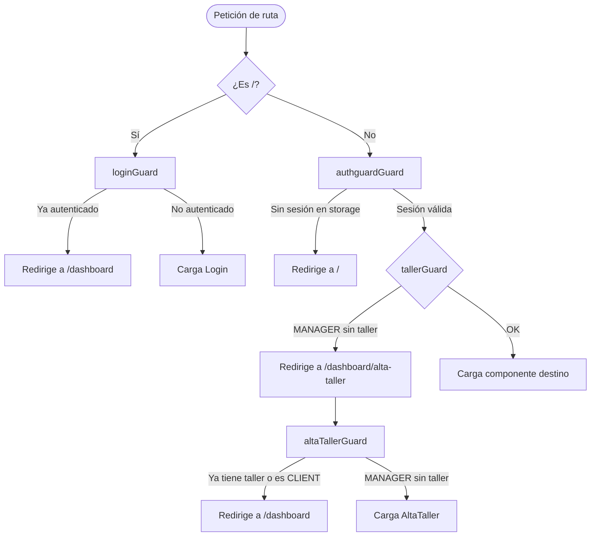
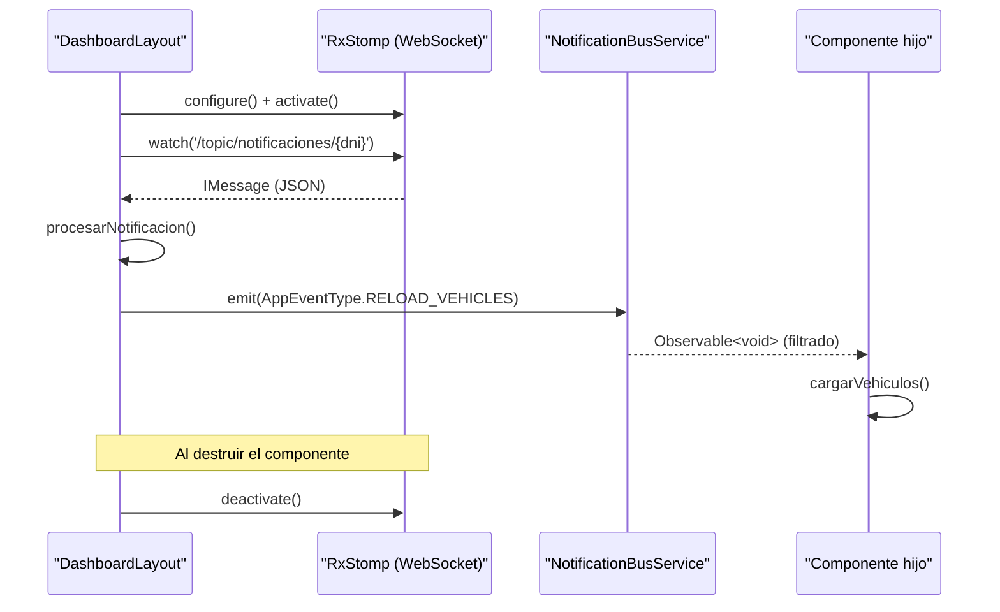

# CarLog — Frontend


CarLog es una aplicación web que digitaliza el ciclo de vida completo del mantenimiento vehicular: desde el alta del taller hasta la facturación detallada por órdenes de trabajo. Ofrece interfaces especializadas para tres roles de usuario: **Gerentes**, **Mecánicos** y **Clientes**.

---

## Estado del proyecto
[](https://sonarcloud.io/summary/new_code?id=JaviRSDEV_FrontCarLog)
[](https://sonarcloud.io/summary/new_code?id=JaviRSDEV_FrontCarLog)
[](https://sonarcloud.io/summary/new_code?id=JaviRSDEV_FrontCarLog)
[](https://sonarcloud.io/summary/new_code?id=JaviRSDEV_FrontCarLog)
[](https://sonarcloud.io/summary/new_code?id=JaviRSDEV_FrontCarLog)

---

## Índice

- [Tech Stack](#tech-stack)
- [Requisitos previos](#requisitos-previos)
- [Instalación](#instalación)
- [Configuración del entorno](#configuración-del-entorno)
- [Scripts disponibles](#scripts-disponibles)
- [Arquitectura](#arquitectura)
- [Rutas y navegación](#rutas-y-navegación)
- [Seguridad y autenticación](#seguridad-y-autenticación)
- [Guards de seguridad](#guards-de-seguridad)
- [Interceptores HTTP](#interceptores-http)
- [Componentes](#componentes)
- [Servicios](#servicios)
- [Modelos de datos](#modelos-de-datos)
- [Notificaciones en tiempo real](#notificaciones-en-tiempo-real)
- [Bus de eventos interno](#bus-de-eventos-interno)
- [Funcionalidades por rol](#funcionalidades-por-rol)
- [Estructura del proyecto](#estructura-del-proyecto)
- [Testing](#testing)
- [Conexión con el Backend](#conexión-con-el-backend)
- [Documentación técnica](#documentación-técnica)
- [Licencia](#licencia)

---

## Tech Stack

| Tecnología          | Versión  | Uso                                      |
|---------------------|----------|------------------------------------------|
| Angular             | 21.2     | Framework principal (Standalone Components) |
| TypeScript          | 5.9      | Lenguaje de desarrollo                   |
| RxJS                | 7.8      | Programación reactiva                    |
| Bootstrap           | 5.3      | Sistema de grid y componentes UI         |
| Bootstrap Icons     | 1.13     | Iconografía                              |
| Tailwind CSS        | 4.1      | Utilidades CSS adicionales               |
| @ng-bootstrap       | 20.0     | Componentes Bootstrap para Angular       |
| SweetAlert2         | 11       | Alertas y modales de usuario             |
| @stomp/rx-stomp     | 1.2      | Cliente WebSocket con protocolo STOMP    |
| SockJS              | 1.6      | Fallback WebSocket                       |
| ngx-cookie-service  | 21.1     | Gestión de cookies                       |
| Vitest              | 4.0+     | Testing unitario                         |
| Prettier            | 3.8      | Formateo de código                       |
| Node.js             | 20+      | Entorno de ejecución                     |
| npm                 | 11+      | Gestor de paquetes                       |

---

## Requisitos previos

- [Node.js](https://nodejs.org/) v20 o superior
- npm v11 o superior
- Backend Spring Boot corriendo (por defecto en `http://localhost:8081`)

---

## Instalación

```bash
# 1. Clonar el repositorio
git clone https://github.com/JaviRSDEV/FrontCarLog.git
cd FrontCarLog

# 2. Instalar dependencias
npm install
```

---

## Configuración del entorno

Los ficheros de entorno **no están incluidos en el repositorio** (están en `.gitignore`). Deben crearse manualmente.

### Desarrollo local

Crea `src/environments/environment.development.ts`:

```typescript
export const environment = {
  production: false,
  apiUrl: 'http://localhost:8081',
  wsUrl: 'ws://localhost:8081/ws-carlog',
};
```

### Producción

Crea `src/environments/environment.ts`:

```typescript
export const environment = {
  production: true,
  apiUrl: 'https://tu-api-en-produccion.com',
  wsUrl: 'wss://tu-api-en-produccion.com/ws-carlog',
};
```

> La plantilla de referencia está en `src/environments/enviroment.example.ts`.

### Configuración WebSocket

La conexión WebSocket se configura en `src/app/config/rx-stomp-config.ts`:

```typescript
export const myRxStompConfig: RxStompConfig = {
  brokerURL: environment.wsUrl,
  heartbeatIncoming: 0,
  heartbeatOutgoing: 20000,
  reconnectDelay: 200,
};
```

---

## Scripts disponibles

| Comando           | Descripción                                        |
|-------------------|----------------------------------------------------|
| `npm start`       | Inicia el servidor de desarrollo en el puerto 4200 |
| `npm run build`   | Compila el proyecto para producción en `dist/`     |
| `npm run watch`   | Compila en modo watch (recarga automática)         |
| `npm test`        | Ejecuta los tests unitarios con Vitest             |

---

## Arquitectura

CarLog está construido con **Angular 21** siguiendo la arquitectura de **Standalone Components** (sin NgModules). Cada componente gestiona sus propias dependencias mediante el array `imports`.

El punto de entrada es `src/main.ts`, que bootstrapea `src/app/app.ts`. La configuración global de providers (router, HTTP client, interceptores) se centraliza en `src/app/app.config.ts`.



---

## Rutas y navegación

| Ruta                            | Componente                  | Guard(s)                        |
|---------------------------------|-----------------------------|---------------------------------|
| `/`                             | `Login`                     | `loginGuard`                    |
| `/dashboard`                    | `DashboardLayout`           | `authguardGuard`                |
| `/dashboard` (home)             | `DashboardComponent`        | `tallerGuard`                   |
| `/dashboard/vehiculos`          | `VehicleListComponent`      | `tallerGuard`                   |
| `/dashboard/mantenimientos`     | `WorkOrdersComponent`       | `tallerGuard`                   |
| `/dashboard/mantenimientos/:id` | `WorkOrderDetailComponent`  | `tallerGuard`                   |
| `/dashboard/taller`             | `GestionTallerComponent`    | `tallerGuard`                   |
| `/dashboard/perfil`             | `GestionTallerComponent`    | `tallerGuard`                   |
| `/dashboard/historial/:plate`   | `VehicleHistoryComponent`   | `tallerGuard`                   |
| `/dashboard/workShop`           | `VisualizarTallerComponent` | `tallerGuard`                   |
| `/dashboard/alta-taller`        | `AltaTaller`                | `altaTallerGuard`               |
| `**`                            | —                           | Redirige a `/dashboard`         |

---

## Seguridad y autenticación

La autenticación se basa en **JWT gestionado mediante cookies seguras**. El flujo de login es:

1. El usuario envía credenciales a `/auth/authenticate`
2. El backend devuelve una cookie JWT HttpOnly
3. El frontend obtiene el perfil completo con `/users/me` y lo persiste en storage
4. Todas las peticiones posteriores incluyen la cookie automáticamente via `withCredentials: true`

### Persistencia de sesión

La sesión se persiste según la opción "Recuérdame":

| Opción          | Storage          |
|-----------------|------------------|
| Recuérdame: Sí  | `localStorage`   |
| Recuérdame: No  | `sessionStorage` |

### Flujo de autenticación



---

## Guards de seguridad

| Guard             | Archivo                                          | Función                                                                 |
|-------------------|--------------------------------------------------|-------------------------------------------------------------------------|
| `loginGuard`      | `core/guards/login-guard/login-guard.ts`         | Redirige a `/dashboard` si el usuario ya está autenticado               |
| `authguardGuard`  | `core/guards/auth-guard/auth-guard.ts`           | Protege todas las rutas del dashboard; requiere sesión activa en storage |
| `tallerGuard`     | `core/guards/taller-guard/taller-guard.ts`       | Verifica que MANAGER/CO_MANAGER tengan taller registrado; si no, redirige a `/dashboard/alta-taller` |
| `altaTallerGuard` | `core/guards/alta-taller-guard/alta-taller-guard.ts` | Bloquea el acceso al formulario de alta si el usuario ya tiene taller o es CLIENT |



---

## Interceptores HTTP

Registrados en `app.config.ts` mediante `provideHttpClient(withInterceptors([...]))`.

### `authInterceptor`

Archivo: `src/app/interceptors/auth-interceptor.ts`

- Solo actúa sobre peticiones dirigidas a `environment.apiUrl`
- Adjunta `withCredentials: true` para incluir la cookie JWT en peticiones cross-origin
- Extrae e inyecta el token XSRF en la cabecera `X-XSRF-TOKEN` para protección CSRF
- Las peticiones a URLs externas pasan sin modificar

### `ErrorInterceptor`

Archivo: `src/app/interceptors/error-interceptor.ts`

| Código HTTP | Comportamiento                                                                 |
|-------------|--------------------------------------------------------------------------------|
| `401`       | Limpia `localStorage`/`sessionStorage`, redirige a `/`, muestra alerta SweetAlert2 |
| `403`       | Muestra alerta SweetAlert2; si el mensaje menciona "taller" o "sesión", limpia la sesión |
| `429`       | Muestra alerta de "demasiados intentos" (rate limiting)                        |
| `500`       | Muestra error genérico de servidor                                             |
| `0`         | Muestra error de "sin conexión con el servidor"                                |
| Otros       | Muestra el mensaje de error del backend o un mensaje genérico                  |

> Las peticiones a `/authenticate` y `/register` no son interceptadas por el `ErrorInterceptor` para permitir manejo de errores local en el componente `Login`.

---

## Componentes

### Páginas (`src/app/pages/`)

#### `Login` — `pages/login/login.ts`

Página de inicio de sesión y registro. Gestiona dos formularios reactivos:

- **Login**: email, password, rememberMe. Valida email y mínimo 6 caracteres en contraseña.
- **Registro**: dni (patrón `\d{8}[a-zA-Z]`), name, email, phone, password, role.

Tras el login, encadena `login()` → `getUserByDni()` con `switchMap` para obtener el perfil completo antes de redirigir. Tras el registro, redirige a `/dashboard/alta-taller` si el rol es `MANAGER`, o a `/dashboard` en caso contrario.

#### `DashboardLayout` — `pages/dashboard-layout/dashboard-layout.ts`

Shell principal del dashboard. Contiene `Header`, `Navbar`, `Footer` y un `<router-outlet>` para los componentes hijos. Gestiona la conexión WebSocket STOMP durante toda la sesión del usuario y despacha notificaciones al `NotificationBusService`.

---

### Componentes Compartidos (`src/app/components/shared/`)

#### `AltaTaller` — `alta-taller/alta-taller.component.ts`

Formulario de registro de nuevo taller para usuarios `MANAGER`. Campos: nombre, dirección, teléfono, email, logo.

Incluye compresión de imágenes mediante la **Canvas API**:
- Redimensiona a máximo 800×600 px
- Convierte a formato **WebP al 70% de calidad**
- Almacena como Base64 en el campo `icon`

Tras crear el taller, actualiza el objeto de usuario en storage con el nuevo `workshopId` y redirige a `/dashboard`.

#### `DashboardComponent` — `dashboard.component/dashboard.component.ts`

Vista principal del dashboard. Muestra un resumen del estado del taller al usuario autenticado.

#### `EmployeeListComponent` — `employee-list-component/employee-list.component/`

Lista de empleados del taller. Permite al gerente ver todos los trabajadores asociados y gestionar sus roles. Se recarga automáticamente al recibir el evento `RELOAD_EMPLOYEES` del bus de notificaciones.

#### `HireWorkerComponent` — `hire-worker-component/hire-worker.component/`

Formulario para contratar/invitar nuevos empleados al taller mediante su DNI. Permite asignar el rol (`MECHANIC`, `CO_MANAGER`).

#### `MiPerfilCardComponent` — `mi-perfil-card-component/mi-perfil-card.component/`

Tarjeta de perfil del usuario autenticado. Muestra y permite editar los datos personales. Gestiona invitaciones pendientes a talleres (aceptar/rechazar).

#### `Navbar` — `navbar/navbar.component.ts`

Barra de navegación lateral. Renderiza los enlaces de navegación según el rol del usuario. Incluye el botón de logout que llama a `AuthService.logout()`.

#### `Header` — `header/header.component.ts`

Cabecera superior del dashboard.

#### `Footer` — `footer/footer.component.ts`

Pie de página de la aplicación.

#### `SearchComponent` — `search-component/search.component/`

Componente de búsqueda reutilizable. Emite el texto de búsqueda al componente padre para filtrar listas de vehículos.

#### `VehicleListComponent` — `vehicle-list-component/vehicle-list-component.component.ts`

Listado de vehículos con tres pestañas según el rol:

| Pestaña          | Contenido                                    | Roles que la ven         |
|------------------|----------------------------------------------|--------------------------|
| `mis-vehiculos`  | Vehículos propiedad del usuario              | Todos                    |
| `asignados`      | Vehículos con órdenes activas del mecánico   | MECHANIC                 |
| `flota`          | Todos los vehículos del taller               | MANAGER, CO_MANAGER      |

Soporta paginación (`Page<Vehicle>`), búsqueda en tiempo real con `SearchComponent`, y se recarga automáticamente al recibir `RELOAD_VEHICLES` del bus de notificaciones.

Acciones disponibles: crear, editar, eliminar vehículo, solicitar ingreso al taller, aprobar/rechazar solicitudes, registrar salida, navegar al historial.

#### `VehicleCardComponent` — `vehicle-card.component/vehicle-card.component.ts`

Tarjeta visual de un vehículo individual. Muestra matrícula, marca, modelo, kilómetros y estado. Emite eventos al componente padre para editar, eliminar, ver detalles o ir al historial.

#### `VehicleDetailModalComponent` — `vehicle-detail-modal.component/vehicle-detail-modal.component.ts`

Modal con el detalle completo de un vehículo: todos los campos técnicos (motor, CV, par, neumáticos), imágenes y acciones contextuales según el rol.

#### `VehicleFormComponent` — `vehicle-form.component/vehicle-form.component.ts`

Formulario reactivo para crear y editar vehículos. Campos: matrícula, marca, modelo, kilómetros, motor, CV, par, neumáticos, imágenes.

#### `VehicleHistoryComponent` — `vehicle-history-component/vehicle-history.component/`

Historial de mantenimientos de un vehículo identificado por su matrícula (parámetro de ruta `:plate`). Muestra las órdenes de trabajo completadas con paginación.

#### `VisualizarTallerComponent` — `visualizar-taller/visualizar-taller.component/`

Perfil público del taller. Muestra nombre, dirección, teléfono, email y logo del taller asociado al usuario.

#### `WorkOrdersComponent` — `work-orders.component/work-orders.component.ts`

Listado de órdenes de trabajo con dos pestañas: **Activas** (PENDING + IN_PROGRESS) y **Completadas**. Usa `computed()` signals para filtrar reactivamente.

La vista se adapta al rol:
- `MANAGER`/`CO_MANAGER`: carga todas las órdenes del taller (`/workorders/workshop/{id}`)
- `MECHANIC`: carga solo las órdenes asignadas (`/workorders/mechanic/{dni}`)

#### `WorkOrderDetailComponent` — `work-order-detail.component/work-order-detail.component.ts`

Vista de detalle de una orden de trabajo individual. Muestra todos los campos, permite cambiar el estado, reasignar mecánico (solo gerentes) y gestionar las líneas de facturación.

#### `WorkOrderFormComponent` — `work-order-form.component/work-order-form.component.ts`

Formulario para crear nuevas órdenes de trabajo. Campos:
- `vehiclePlate`: matrícula con validación de patrón `/^\d{4}[A-Z]{3}$/i`
- `description`: descripción con mínimo 10 caracteres

Carga la lista de vehículos disponibles del taller para selección.

#### `WorkOrderLinesComponent` — `work-order-lines.component/work-order-lines.component.ts`

Gestión de líneas de facturación de una orden de trabajo. Permite añadir, editar y eliminar líneas con cálculo automático de subtotales (cantidad × precio × IVA − descuento).

#### `GestionTallerComponent` — `gestion-taller-component/gestion-taller.component/`

Panel de gestión del taller. Accesible desde `/dashboard/taller` y `/dashboard/perfil`. Permite al gerente:
- Ver y editar los datos del taller (nombre, dirección, teléfono, email, logo)
- Subir logo mediante `multipart/form-data`
- Gestionar empleados (incluye `EmployeeListComponent` y `HireWorkerComponent`)

---

## Servicios

### `Auth` — `services/authService/auth.service.ts`

| Método                  | HTTP              | Endpoint                  | Descripción                                      |
|-------------------------|-------------------|---------------------------|--------------------------------------------------|
| `login(credentials)`    | `POST`            | `/auth/authenticate`      | Inicia sesión, devuelve `User` con cookie JWT    |
| `register(userData)`    | `POST`            | `/auth/register`          | Registra nuevo usuario                           |
| `logout()`              | `POST`            | `/auth/logout`            | Cierra sesión en backend y limpia storage local  |
| `getUserFromStorage()`  | —                 | —                         | Lee el usuario de `localStorage` o `sessionStorage` |
| `saveUserToStorage(user)` | —               | —                         | Guarda el usuario respetando el storage original |
| `isLoggedIn()`          | —                 | —                         | Comprueba si hay sesión activa                   |

### `VehicleService` — `services/vehicleService/vehicle.service.ts`

Base URL: `/vehicles`

| Método                                          | HTTP     | Endpoint                              |
|-------------------------------------------------|----------|---------------------------------------|
| `getVehiclesByWorkshop(workshopId, page, size)` | `GET`    | `/vehicles?workshopId=&page=&size=`   |
| `getVehiclesByOwner(ownerId, page, size)`        | `GET`    | `/vehicles?ownerId=&page=&size=`      |
| `getAllVehicles(page, size)`                     | `GET`    | `/vehicles?page=&size=`               |
| `createVehicle(vehicle)`                        | `POST`   | `/vehicles`                           |
| `updateVehicle(plate, vehicleData)`             | `PUT`    | `/vehicles/{plate}`                   |
| `deleteVehicle(plate)`                          | `DELETE` | `/vehicles/{plate}`                   |
| `getVehicleInRepair(mechanicId, page, size)`    | `GET`    | `/vehicles/repairing?mechanicId=`     |
| `requestEntry(plate, workshopId)`               | `PUT`    | `/vehicles/{plate}/request-entry/{workshopId}` |
| `approveEntry(plate)`                           | `PUT`    | `/vehicles/{plate}/approve-entry`     |
| `rejectEntry(plate)`                            | `PUT`    | `/vehicles/{plate}/reject-entry`      |
| `registerExit(plate, workshopId)`               | `POST`   | `/vehicles/{plate}/exit/{workshopId}` |
| `getHistoryByPlate(plate, page, size)`          | `GET`    | `/vehicles/{plate}/history`           |
| `searchVehicles(q, workshopId, type, page, size)` | `GET`  | `/vehicles/search`                    |

### `WorkOrderService` — `services/workOrderService/work-order.service.ts`

Base URL: `/workorders`

| Método                                          | HTTP      | Endpoint                                    |
|-------------------------------------------------|-----------|---------------------------------------------|
| `getAllWorkOrders(workshopId)`                   | `GET`     | `/workorders/workshop/{id}`                 |
| `getWorkOrdersByMechanic(dni)`                  | `GET`     | `/workorders/mechanic/{dni}`                |
| `getWorkOrderById(id)`                          | `GET`     | `/workorders/{id}`                          |
| `createWorkOrder(dto)`                          | `POST`    | `/workorders`                               |
| `updateWorkOrder(id, dto)`                      | `PUT`     | `/workorders/{id}`                          |
| `deleteWorkOrder(id)`                           | `DELETE`  | `/workorders/{id}`                          |
| `addWorkOrderLine(orderId, lineData)`           | `POST`    | `/workorders/{orderId}/lines`               |
| `updateWorkOrderLine(orderId, lineId, data)`    | `PUT`     | `/workorders/{orderId}/lines/{lineId}`      |
| `deleteWorkOrderLine(orderId, lineId)`          | `DELETE`  | `/workorders/{orderId}/lines/{lineId}`      |
| `reassignWorkOrder(orderId, newMechanicId)`     | `PATCH`   | `/workorders/{orderId}/reassign`            |

### `TallerService` — `services/tallerService/taller.service.ts`

Base URL: `/workshop`

| Método                                        | HTTP   | Endpoint                          |
|-----------------------------------------------|--------|-----------------------------------|
| `crearTaller(taller)`                         | `POST` | `/workshop/create`                |
| `getTallerPorId(workshopId)`                  | `GET`  | `/workshop/details/{workshopId}`  |
| `actualizarTaller(workshopId, datosTaller)`   | `PUT`  | `/workshop/details/{workshopId}`  |
| `actualizarTallerConFoto(workshopId, formData)` | `PUT` | `/workshop/details/{workshopId}` |
| `getMecanicosPorTaller(workshopId)`           | `GET`  | `/workshop/{workshopId}/employees`|

### `UserService` — `services/userService/user.service.ts`

Base URL: `/users`

| Método                                              | HTTP    | Endpoint                    |
|-----------------------------------------------------|---------|-----------------------------|
| `getUserByDni()`                                    | `GET`   | `/users/me`                 |
| `edit(userData, dni)`                               | `PUT`   | `/users/{dni}`              |
| `invite(dni, managerDni, newRole)`                  | `PATCH` | `/users/{dni}/invite`       |
| `acceptInvitation(dni)`                             | `PATCH` | `/users/accept`             |
| `rejectInvitation(dni)`                             | `PATCH` | `/users/reject`             |
| `contratarEmpleados(managerDni, employeeDni, role)` | `PATCH` | `/users/promote`            |
| `fireEmployee(dni)`                                 | `PATCH` | `/users/{dni}/fire`         |

### `NotificationBusService` — `services/notification-bus/notification-bus.service.ts`

Bus de eventos interno basado en `Subject<AppEventType>`. Desacopla el `DashboardLayout` (que recibe notificaciones WebSocket) de los componentes hijos que deben reaccionar a ellas.

```typescript
export enum AppEventType {
  RELOAD_VEHICLES  = 'RELOAD_VEHICLES',
  RELOAD_EMPLOYEES = 'RELOAD_EMPLOYEES',
  NEW_INVITE       = 'NEW_INVITE',
  VEHICLE_REQUEST  = 'VEHICLE_REQUEST',
}
```

| Método          | Descripción                                      |
|-----------------|--------------------------------------------------|
| `emit(event)`   | Publica un evento en el bus                                          |
| `on(eventType)` | Devuelve un `Observable<void>` filtrado por tipo de evento           |

**Uso típico en un componente hijo:**

```typescript
this.notificationBus.on(AppEventType.RELOAD_VEHICLES)
  .pipe(takeUntilDestroyed(this.destroyRef))
  .subscribe(() => this.cargarVehiculos());
```

---

## Modelos de datos

### `User` — `src/app/models/user.ts`

```typescript
interface User {
  dni: string;
  name: string;
  email: string;
  phone: string;
  role: string;                          // 'MANAGER' | 'CO_MANAGER' | 'MECHANIC' | 'CLIENT'
  userId?: string;
  workShopId?: number;
  workshop?: string | { workshopName: string };
  vehicles: Vehicle[];
  mustChangePsswd: boolean;
  pendingWorkshop?: number | null;       // Invitación pendiente
  pendingWorkshopName?: string | null;
  pendingRole?: string | null;
  token?: string;
  accountNonExpired: boolean;
  accountNonLocked: boolean;
  credentialsNonExpired: boolean;
  enabled: boolean;
  authorities: { authority: string }[];
  username: string;
}
```

### `Vehicle` — `src/app/models/vehicle.ts`

```typescript
interface Vehicle {
  id?: number;
  plate: string;                         // Matrícula (PK)
  brand: string;
  model: string;
  kilometers: number;
  engine: string;
  horsePower: number;
  torque: number;
  tires: string;
  images?: string[];
  lastMaintenance: string | null;
  workshopId?: number | null;            // Taller actual
  ownerId?: string;                      // DNI del propietario
  pendingWorkshopId?: number | null;     // Solicitud de ingreso pendiente
  pendingWorkshopName?: number | null;
}
```

### `Workorder` — `src/app/models/workorder.ts`

```typescript
type WorkOrderStatus = 'PENDING' | 'IN_PROGRESS' | 'COMPLETED';

interface Workorder {
  id: number;
  description?: string;
  mechanicNotes?: string;
  status: WorkOrderStatus;
  createdAt?: string;
  closedAt?: string;
  vehicle: Vehicle;
  mechanic: User;
  mechanicName?: string;
  workshop: Workshop;
  totalAmount: number;
  lines: WorkOrderLine[];
}

interface CreateWorkOrderDto {
  description: string;
  vehiclePlate: string;
}

interface UpdateWorkOrderDto {
  mechanicNotes?: string;
  status?: string;
}
```

### `WorkOrderLine` — `src/app/models/workorderline.ts`

```typescript
interface WorkOrderLine {
  id: number;
  concept?: string;
  quantity: number;
  pricePerUnit: number;
  IVA: number;
  discount: number;
  subTotal?: number;                     // Calculado: qty × price × (1 + IVA/100) − discount
}

interface CreateWorkOrderLineDto {
  concept: string;
  quantity: number;
  pricePerUnit: number;
  IVA: number;
  discount: number;
}
```

### `Workshop` — `src/app/models/workshop.ts`

```typescript
interface Workshop {
  workshopId: number;
  workshopName: string;
  address: string;
  workshopPhone: string;
  workshopEmail: string;
  icon: string;                          // Base64 WebP
  vehicles: Vehicle[];
}
```

### `Auth` — `src/app/models/auth.ts`

```typescript
interface Auth {
  token: string;
  role: string;
  workshop: string;
}
```

### `Page<T>` — `src/app/models/page.model.ts`

Modelo genérico de paginación compatible con Spring Data:

```typescript
interface Page<T> {
  content: T[];
  totalElements: number;
  totalPages: number;
  size: number;
  number: number;                        // Página actual (0-indexed)
  first: boolean;
  last: boolean;
}
```

---

## Notificaciones en tiempo real

CarLog usa **WebSockets con protocolo STOMP** (`@stomp/rx-stomp`) para notificaciones instantáneas. La conexión se gestiona en `DashboardLayout` durante toda la sesión del usuario.

### Configuración — `src/app/config/rx-stomp-config.ts`

```typescript
export const myRxStompConfig: RxStompConfig = {
  brokerURL: environment.wsUrl,
  heartbeatIncoming: 0,
  heartbeatOutgoing: 20000,   // Ping cada 20 segundos
  reconnectDelay: 200,        // Reconexión automática en 200ms
};
```

### Canal de suscripción

Cada usuario se suscribe a su canal personal:

```
/topic/notificaciones/{dni}
```

### Tipos de notificación

| Tipo               | Efecto en el frontend                                                        |
|--------------------|------------------------------------------------------------------------------|
| `FIRE`             | Muestra alerta bloqueante y fuerza logout del empleado despedido             |
| `INVITE`           | Muestra toast informativo + emite `NEW_INVITE` al bus interno                |
| `VEHICLE_REQUEST`  | Muestra toast + emite `RELOAD_VEHICLES` para recargar la lista de vehículos  |
| `NEW_EMPLOYEE`     | Emite `RELOAD_EMPLOYEES` para recargar la lista de empleados                 |
| `NEW_FLEET_VEHICLE`| Emite `RELOAD_VEHICLES` para recargar la flota del taller                    |

### Ciclo de vida de la conexión



---

## Bus de eventos interno

`NotificationBusService` (`src/app/services/notification-bus/notification-bus.service.ts`) es un servicio singleton (`providedIn: 'root'`) que actúa como bus de eventos interno basado en `Subject<AppEventType>`.

Su propósito es desacoplar el `DashboardLayout` (receptor de WebSocket) de los componentes hijos que necesitan reaccionar a los eventos.

```typescript
export enum AppEventType {
  RELOAD_VEHICLES  = 'RELOAD_VEHICLES',
  RELOAD_EMPLOYEES = 'RELOAD_EMPLOYEES',
  NEW_INVITE       = 'NEW_INVITE',
  VEHICLE_REQUEST  = 'VEHICLE_REQUEST',
}
```

| Método          | Firma                                    | Descripción                                          |
|-----------------|------------------------------------------|------------------------------------------------------|
| `emit(event)`   | `(event: AppEventType): void`            | Publica un evento en el Subject                      |
| `on(eventType)` | `(eventType: AppEventType): Observable<void>` | Devuelve un Observable filtrado por tipo de evento |

---

## Funcionalidades por rol

| Funcionalidad                          | MANAGER | CO_MANAGER | MECHANIC | CLIENT |
|----------------------------------------|:-------:|:----------:|:--------:|:------:|
| Registrar taller                       | ✅      | ❌         | ❌       | ❌     |
| Editar datos del taller                | ✅      | ✅         | ❌       | ❌     |
| Invitar / contratar empleados          | ✅      | ✅         | ❌       | ❌     |
| Despedir empleados                     | ✅      | ✅         | ❌       | ❌     |
| Ver lista de empleados                 | ✅      | ✅         | ❌       | ❌     |
| Ver flota completa del taller          | ✅      | ✅         | ❌       | ❌     |
| Aprobar / rechazar ingreso de vehículo | ✅      | ✅         | ❌       | ❌     |
| Registrar salida de vehículo           | ✅      | ✅         | ❌       | ❌     |
| Ver vehículos propios                  | ✅      | ✅         | ✅       | ✅     |
| Crear / editar / eliminar vehículo     | ✅      | ✅         | ✅       | ✅     |
| Solicitar ingreso al taller            | ✅      | ✅         | ✅       | ✅     |
| Ver vehículos asignados (en reparación)| ❌      | ❌         | ✅       | ❌     |
| Ver todas las órdenes del taller       | ✅      | ✅         | ❌       | ❌     |
| Ver órdenes asignadas                  | ❌      | ❌         | ✅       | ❌     |
| Crear orden de trabajo                 | ✅      | ✅         | ❌       | ❌     |
| Actualizar estado de orden             | ✅      | ✅         | ✅       | ❌     |
| Reasignar mecánico en orden            | ✅      | ✅         | ❌       | ❌     |
| Gestionar líneas de facturación        | ✅      | ✅         | ✅       | ❌     |
| Ver historial de vehículo              | ✅      | ✅         | ✅       | ✅     |
| Aceptar / rechazar invitación          | ✅      | ✅         | ✅       | ✅     |
| Editar perfil propio                   | ✅      | ✅         | ✅       | ✅     |

---

## Estructura del proyecto

```
src/
├── app/
│   ├── components/shared/
│   │   ├── alta-taller/                         # Registro de nuevo taller (con compresión WebP)
│   │   ├── dashboard.component/                 # Vista principal del dashboard
│   │   ├── employee-list-component/             # Lista de empleados del taller
│   │   ├── footer/                              # Pie de página
│   │   ├── gestion-taller-component/            # Panel de gestión del taller
│   │   ├── header/                              # Cabecera superior
│   │   ├── hire-worker-component/               # Formulario de contratación de empleados
│   │   ├── mi-perfil-card-component/            # Tarjeta de perfil e invitaciones
│   │   ├── navbar/                              # Barra de navegación lateral
│   │   ├── search-component/                    # Componente de búsqueda reutilizable
│   │   ├── vehicle-card.component/              # Tarjeta visual de vehículo
│   │   ├── vehicle-detail-modal.component/      # Modal de detalle de vehículo
│   │   ├── vehicle-form.component/              # Formulario de vehículo
│   │   ├── vehicle-history-component/           # Historial de mantenimientos por matrícula
│   │   ├── vehicle-list-component/              # Listado de vehículos con pestañas y paginación
│   │   ├── visualizar-taller/                   # Perfil público del taller
│   │   ├── work-order-detail.component/         # Detalle de orden de trabajo
│   │   ├── work-order-form.component/           # Formulario de nueva orden de trabajo
│   │   ├── work-order-lines.component/          # Líneas de facturación
│   │   └── work-orders.component/               # Listado de órdenes (activas / completadas)
│   ├── config/
│   │   └── rx-stomp-config.ts                   # Configuración WebSocket STOMP
│   ├── core/guards/
│   │   ├── auth-guard/                          # authguardGuard
│   │   ├── login-guard/                         # loginGuard
│   │   ├── taller-guard/                        # tallerGuard
│   │   └── alta-taller-guard/                   # altaTallerGuard
│   ├── interceptors/
│   │   ├── auth-interceptor.ts                  # withCredentials + XSRF token
│   │   └── error-interceptor.ts                 # Manejo global de errores HTTP
│   ├── models/
│   │   ├── auth.ts                              # Respuesta de autenticación
│   │   ├── page.model.ts                        # Paginación genérica Page<T>
│   │   ├── user.ts                              # Usuario y roles
│   │   ├── vehicle.ts                           # Vehículo
│   │   ├── workorder.ts                         # Orden de trabajo + DTOs
│   │   ├── workorderline.ts                     # Línea de facturación + DTOs
│   │   └── workshop.ts                          # Taller
│   ├── pages/
│   │   ├── login/                               # Página de login y registro
│   │   └── dashboard-layout/                    # Shell del dashboard + WebSocket
│   ├── services/
│   │   ├── authService/                         # Login, registro, logout, storage
│   │   ├── notification-bus/                    # Bus interno de eventos (AppEventType)
│   │   ├── tallerService/                       # CRUD de taller
│   │   ├── userService/                         # Perfil, invitaciones, empleados
│   │   ├── vehicleService/                      # CRUD y flujo de vehículos
│   │   └── workOrderService/                    # CRUD de órdenes y líneas
│   ├── app.config.ts                            # Providers globales
│   ├── app.routes.ts                            # Definición de rutas
│   ├── app.html                                 # Template raíz
│   └── app.ts                                   # Componente raíz
└── environments/
    └── enviroment.example.ts                    # Plantilla de configuración
```

---

## Testing

Los tests unitarios se ejecutan con **Vitest** mediante el builder `@angular/build:unit-test`. Los ficheros `.spec.ts` están co-localizados junto al código fuente.

```bash
npm test
```

### Cobertura de tests

| Categoría      | Ficheros spec                                                                                          |
|----------------|--------------------------------------------------------------------------------------------------------|
| Guards         | `login-guard.spec.ts`, `taller-guard.spec.ts`, `alta-taller-guard.spec.ts`, `authguard.spec.ts`       |
| Servicios      | `authService.spec.ts`, `TallerService.spec.ts`, `user.service.spec.ts`, `vehicle.spec.ts`             |
| Componentes    | `app.spec.ts`, `navbar.spec.ts`, `dashboard-layout.spec.ts`, `login.spec.ts`                          |
| Interceptores  | `auth-interceptor.spec.ts`                                                                             |

### Configuración del runner

El builder de tests está configurado en `angular.json`:

```json
"test": {
  "builder": "@angular/build:unit-test"
}
```

Los tests se ejecutan con Vitest como motor subyacente. Cada fichero `.spec.ts` está co-localizado junto al archivo que prueba, siguiendo la convención de Angular.

---

## Conexión con el Backend

CarLog Frontend consume una API REST Spring Boot. Todos los endpoints están prefijados con la URL definida en `environment.apiUrl`.

### Resumen de endpoints consumidos

| Dominio        | Base URL        | Descripción                                      |
|----------------|-----------------|--------------------------------------------------|
| Autenticación  | `/auth`         | Login, registro, logout                          |
| Usuarios       | `/users`        | Perfil, invitaciones, gestión de empleados       |
| Vehículos      | `/vehicles`     | CRUD, flujo de ingreso/salida, historial, búsqueda |
| Órdenes        | `/workorders`   | CRUD de órdenes y líneas de facturación          |
| Taller         | `/workshop`     | CRUD del taller y consulta de empleados          |
| WebSocket      | `/ws-carlog`    | Canal STOMP para notificaciones en tiempo real   |

### Requisitos del backend

- CORS configurado para permitir el origen del frontend (`http://localhost:4200` en desarrollo)
- Cookies JWT con flags `HttpOnly` y `SameSite=None; Secure` para peticiones cross-origin
- Endpoint STOMP en `/ws-carlog` con soporte SockJS
- Soporte de XSRF token en cabecera `X-XSRF-TOKEN`

### Variables de entorno necesarias

```typescript
// src/environments/environment.development.ts
export const environment = {
  production: false,
  apiUrl: 'http://localhost:8081',
  wsUrl:  'ws://localhost:8081/ws-carlog',
};

// src/environments/environment.ts  (producción)
export const environment = {
  production: true,
  apiUrl: 'https://tu-api.com',
  wsUrl:  'wss://tu-api.com/ws-carlog',
};
```

> La plantilla de referencia está en `src/environments/enviroment.example.ts`.

### Configuración de build por entorno

En desarrollo, `angular.json` reemplaza automáticamente `environment.ts` por `environment.development.ts`:

```json
"fileReplacements": [
  {
    "replace": "src/environments/environment.ts",
    "with":    "src/environments/environment.development.ts"
  }
]
```

---
## Documentación técnica

* [Documentación técnica (Versión en español)](docs/CARLOG_DOCUMENTATION_ESP.pdf)
* [Technical Documentation (English Version)](docs/CARLOG_DOCUMENTATION_ENG.pdf)

---
## Licencia

Este proyecto es de uso académico/privado. Consulta con el autor para cualquier uso externo.
