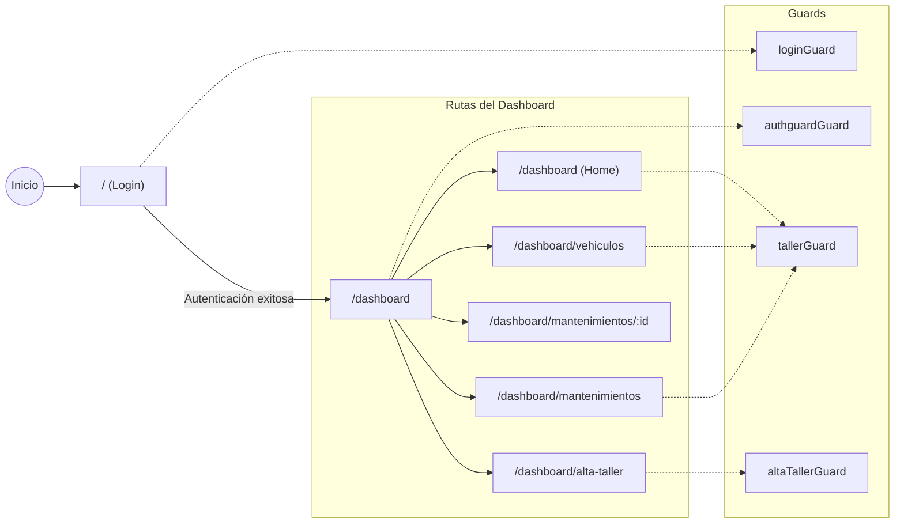

Aquí tienes un README completo para la raíz del repositorio:

---

# CarLog — Plataforma de Gestión de Taller

CarLog es una plataforma web de gestión de talleres mecánicos que digitaliza el ciclo de vida del mantenimiento vehicular: desde el alta del taller hasta la gestión de órdenes de trabajo con facturación detallada. Ofrece interfaces especializadas para distintos roles de usuario (Gerentes, Mecánicos y Clientes).

## Tech Stack

| Tecnología | Versión |
|---|---|
| **Angular** | 21 |
| **Bootstrap** | 5.3 |
| **Bootstrap Icons** | 1.13 |
| **Tailwind CSS** | 4.1 |
| **Vitest** | 4.0 |
| **TypeScript** | 5.9 |
| **Node (npm)** | 11.9 |

## Requisitos previos

- [Node.js](https://nodejs.org/) (v20+ recomendado)
- npm 11+
- API REST backend corriendo en `Springboot`

## Instalación

```bash
# Clonar el repositorio
git clone https://github.com/JaviRSDEV/FrontCarLog.git
cd FrontCarLog

# Instalar dependencias
npm install
```

## Scripts disponibles

| Comando | Descripción |
|---|---|
| `npm start` | Inicia el servidor de desarrollo en `http://localhost:4200` |
| `npm run build` | Compila el proyecto para producción en `dist/` |
| `npm run watch` | Compila en modo watch (desarrollo) |
| `npm test` | Ejecuta los tests unitarios con Vitest |

## Estructura del proyecto

```
src/app/
├── components/shared/       # Componentes reutilizables de la UI
│   ├── alta-taller/         # Registro de nuevo taller
│   ├── dashboard.component/ # Vista principal del dashboard
│   ├── header/              # Cabecera
│   ├── navbar/              # Barra de navegación lateral
│   ├── footer/              # Pie de página
│   ├── vehicle-card.component/
│   ├── vehicle-detail-modal.component/
│   ├── vehicle-form.component/
│   ├── vehicle-list-component/
│   ├── work-order-detail.component/
│   ├── work-order-form.component/
│   ├── work-order-lines.component/  # Líneas de facturación
│   └── work-orders.component/
├── core/guards/             # Guards de ruta (auth, taller, login, alta-taller)
├── interceptors/            # HTTP interceptor para autenticación (JWT)
├── models/                  # Interfaces TypeScript
│   ├── auth.ts
│   ├── user.ts
│   ├── vehicle.ts
│   ├── workorder.ts
│   ├── workorderline.ts
│   └── workshop.ts
├── pages/                   # Páginas principales
│   ├── login/               # Página de inicio de sesión
│   └── dashboard-layout/    # Layout protegido del dashboard
├── services/                # Servicios de comunicación con la API
│   ├── authService/
│   ├── tallerService/
│   ├── userService/
│   ├── vehicleService/
│   └── workOrderService/
├── app.config.ts            # Configuración de la aplicación
├── app.routes.ts            # Definición de rutas
├── app.html                 # Template raíz
└── app.ts                   # Componente raíz
```

## Arquitectura y flujo de navegación



### Flujo de seguridad

- **`loginGuard`** — Redirige usuarios ya autenticados al dashboard.
- **`authguardGuard`** — Protege todas las rutas del dashboard; requiere sesión activa.
- **`tallerGuard`** — Verifica que el gerente tenga un taller registrado antes de acceder a gestión.
- **`altaTallerGuard`** — Controla el acceso al formulario de alta de taller.

## Funcionalidades principales

- **Autenticación** — Login con JWT, interceptor HTTP automático para adjuntar tokens.
- **Alta de Taller** — Flujo de registro para nuevos talleres mecánicos.
- **Gestión de Vehículos** — Listado, creación, edición y detalle de vehículos asociados al taller.
- **Órdenes de Trabajo** — Creación y seguimiento de órdenes con estados (PENDING, IN_PROGRESS, COMPLETED).
- **Líneas de Facturación** — Detalle de servicios y costes por orden de trabajo.
- **Roles de Usuario** — Interfaces adaptadas para Gerentes, Mecánicos y Clientes.

## Conexión con el Backend

La aplicación se conecta a una API REST (por defecto en `localhost:8081`). El `authInterceptor` se encarga de adjuntar el token JWT a cada petición HTTP saliente.

## Testing

```bash
npm test
```

Los tests unitarios se ejecutan con [Vitest](https://vitest.dev/) mediante el builder `@angular/build:unit-test`.

## Licencia

Este proyecto es privado. Consulta con el propietario del repositorio para más información.
```

---

### Citations

**File:** package.json (L1-10)
```json
{
  "name": "proyecto-angular",
  "version": "0.0.0",
  "scripts": {
    "ng": "ng",
    "start": "ng serve",
    "build": "ng build",
    "watch": "ng build --watch --configuration development",
    "test": "ng test"
  },
```
