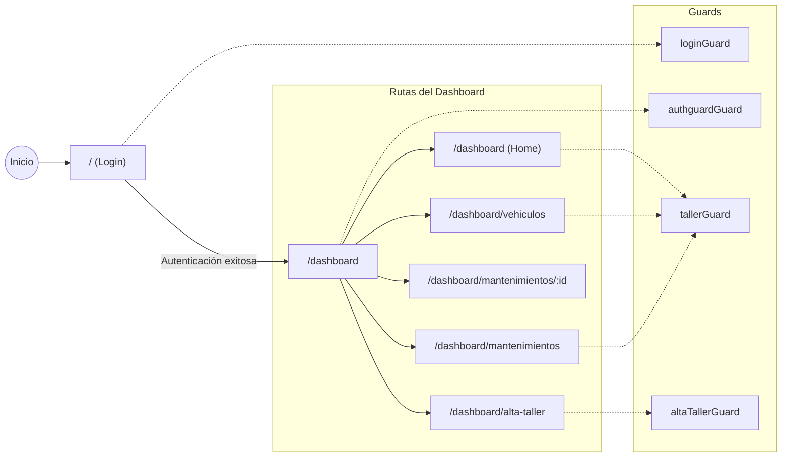

Aquí tienes un README completo para la raíz del repositorio:

---

# CarLog — Plataforma de Gestión de Taller

CarLog es una plataforma web de gestión de talleres mecánicos que digitaliza el ciclo de vida del mantenimiento vehicular: desde el alta del taller hasta la gestión de órdenes de trabajo con facturación detallada. Ofrece interfaces especializadas para distintos roles de usuario (Gerentes, Mecánicos y Clientes).

## Tech Stack

| Tecnología | Versión |
|---|---|
| **Angular** | 21 |
| **Bootstrap** | 5.3 |
| **Bootstrap Icons** | 1.13 |
| **Tailwind CSS** | 4.1 |
| **Vitest** | 4.0 |
| **TypeScript** | 5.9 |
| **Node (npm)** | 11.9 |

## Requisitos previos

- [Node.js](https://nodejs.org/) (v20+ recomendado)
- npm 11+
- API REST backend corriendo en `Springboot`

## Instalación

```bash
# Clonar el repositorio
git clone https://github.com/JaviRSDEV/FrontCarLog.git
cd FrontCarLog

# Instalar dependencias
npm install
```

## Scripts disponibles

| Comando | Descripción |
|---|---|
| `npm start` | Inicia el servidor de desarrollo en `http://localhost:4200` |
| `npm run build` | Compila el proyecto para producción en `dist/` |
| `npm run watch` | Compila en modo watch (desarrollo) |
| `npm test` | Ejecuta los tests unitarios con Vitest |

## Estructura del proyecto

```
src/app/
├── components/shared/       # Componentes reutilizables de la UI
│   ├── alta-taller/         # Registro de nuevo taller
│   ├── dashboard.component/ # Vista principal del dashboard
│   ├── header/              # Cabecera
│   ├── navbar/              # Barra de navegación lateral
│   ├── footer/              # Pie de página
│   ├── vehicle-card.component/
│   ├── vehicle-detail-modal.component/
│   ├── vehicle-form.component/
│   ├── vehicle-list-component/
│   ├── work-order-detail.component/
│   ├── work-order-form.component/
│   ├── work-order-lines.component/  # Líneas de facturación
│   └── work-orders.component/
├── core/guards/             # Guards de ruta (auth, taller, login, alta-taller)
├── interceptors/            # HTTP interceptor para autenticación (JWT)
├── models/                  # Interfaces TypeScript
│   ├── auth.ts
│   ├── user.ts
│   ├── vehicle.ts
│   ├── workorder.ts
│   ├── workorderline.ts
│   └── workshop.ts
├── pages/                   # Páginas principales
│   ├── login/               # Página de inicio de sesión
│   └── dashboard-layout/    # Layout protegido del dashboard
├── services/                # Servicios de comunicación con la API
│   ├── authService/
│   ├── tallerService/
│   ├── userService/
│   ├── vehicleService/
│   └── workOrderService/
├── app.config.ts            # Configuración de la aplicación
├── app.routes.ts            # Definición de rutas
├── app.html                 # Template raíz
└── app.ts                   # Componente raíz
```

## Arquitectura y flujo de navegación



### Flujo de seguridad

- **`loginGuard`** — Redirige usuarios ya autenticados al dashboard.
- **`authguardGuard`** — Protege todas las rutas del dashboard; requiere sesión activa.
- **`tallerGuard`** — Verifica que el gerente tenga un taller registrado antes de acceder a gestión.
- **`altaTallerGuard`** — Controla el acceso al formulario de alta de taller.

## Funcionalidades principales

- **Autenticación** — Login con JWT, interceptor HTTP automático para adjuntar tokens.
- **Alta de Taller** — Flujo de registro para nuevos talleres mecánicos.
- **Gestión de Vehículos** — Listado, creación, edición y detalle de vehículos asociados al taller.
- **Órdenes de Trabajo** — Creación y seguimiento de órdenes con estados (PENDING, IN_PROGRESS, COMPLETED).
- **Líneas de Facturación** — Detalle de servicios y costes por orden de trabajo.
- **Roles de Usuario** — Interfaces adaptadas para Gerentes, Mecánicos y Clientes.

## Conexión con el Backend

La aplicación se conecta a una API REST (por defecto en `localhost:8081`). El `authInterceptor` se encarga de adjuntar el token JWT a cada petición HTTP saliente.

## Testing

```bash
npm test
```

Los tests unitarios se ejecutan con [Vitest](https://vitest.dev/) mediante el builder `@angular/build:unit-test`.

## Licencia

Este proyecto es privado. Consulta con el propietario del repositorio para más información.
```

---

Este README cubre los aspectos clave del proyecto:

- **Descripción general** del propósito de CarLog [1](#0-0) 
- **Stack tecnológico** basado en las dependencias reales del `package.json` [2](#0-1) 
- **Estructura de carpetas** reflejando la organización real en `src/app/`

- **Diagrama de rutas y guards** basado en `app.routes.ts` [3](#0-2) 
- **Configuración del interceptor** desde `app.config.ts` [4](#0-3) 
- **Scripts npm** disponibles para desarrollo, build y testing [5](#0-4) 

Puedes copiar el bloque markdown directamente y reemplazar el `README.md` actual que solo contiene el boilerplate por defecto de Angular CLI. [6](#0-5)

### Citations

**File:** package.json (L1-10)
```json
{
  "name": "proyecto-angular",
  "version": "0.0.0",
  "scripts": {
    "ng": "ng",
    "start": "ng serve",
    "build": "ng build",
    "watch": "ng build --watch --configuration development",
    "test": "ng test"
  },
```

**File:** package.json (L13-40)
```json
  "dependencies": {
    "@angular/common": "^21.2.0",
    "@angular/compiler": "^21.2.0",
    "@angular/core": "^21.2.0",
    "@angular/forms": "^21.2.0",
    "@angular/platform-browser": "^21.2.0",
    "@angular/router": "^21.2.0",
    "@popperjs/core": "^2.11.8",
    "bootstrap": "^5.3.8",
    "bootstrap-icons": "^1.13.1",
    "ngx-cookie-service": "^21.1.0",
    "rxjs": "~7.8.0",
    "tslib": "^2.3.0"
  },
  "devDependencies": {
    "@angular/build": "^21.2.0",
    "@angular/cli": "^21.2.0",
    "@angular/compiler-cli": "^21.2.0",
    "@angular/localize": "^21.2.0",
    "@ng-bootstrap/ng-bootstrap": "^20.0.0",
    "@tailwindcss/postcss": "^4.1.12",
    "jsdom": "^28.0.0",
    "postcss": "^8.5.3",
    "prettier": "^3.8.1",
    "tailwindcss": "^4.1.12",
    "typescript": "~5.9.2",
    "vitest": "^4.0.8"
  }
```

**File:** src/app/app.routes.ts (L13-59)
```typescript
export const routes: Routes = [

  {
    path: '',
    component: Login,
    pathMatch: 'full',
    canActivate: [loginGuard]
  },
  {
    path: 'dashboard',
    component: DashboardLayout,
    canActivate: [authguardGuard],
    children: [
    {
      path: '',
      pathMatch: 'full',
      component: DashboardComponent,
      canActivate: [tallerGuard],
      children: []
    },
    {
      path: 'vehiculos',
      component: VehicleListComponent,
      canActivate: [tallerGuard]
    },
    {
      path: 'alta-taller',
      component: AltaTaller,
      canActivate: [altaTallerGuard]
    },
    {
      path: 'mantenimientos',
      component: WorkOrdersComponent,
      canActivate: [tallerGuard]
    },
    {
      path: 'mantenimientos/:id',
      component: WorkOrderDetailComponent,
      canActivate: [tallerGuard]
    }
  ]
  },
  {
    path: '**',
    redirectTo: 'dashboard'
  },
];
```

**File:** src/app/app.config.ts (L7-12)
```typescript
export const appConfig: ApplicationConfig = {
  providers: [
    provideBrowserGlobalErrorListeners(),
    provideRouter(routes),
    provideHttpClient(withInterceptors([authInterceptor]))
  ]
```

**File:** README.md (L1-59)
```markdown
# ProyectoAngular

This project was generated using [Angular CLI](https://github.com/angular/angular-cli) version 21.2.0.

## Development server

To start a local development server, run:

```bash
ng serve
```

Once the server is running, open your browser and navigate to `http://localhost:4200/`. The application will automatically reload whenever you modify any of the source files.

## Code scaffolding

Angular CLI includes powerful code scaffolding tools. To generate a new component, run:

```bash
ng generate component component-name
```

For a complete list of available schematics (such as `components`, `directives`, or `pipes`), run:

```bash
ng generate --help
```

## Building

To build the project run:

```bash
ng build
```

This will compile your project and store the build artifacts in the `dist/` directory. By default, the production build optimizes your application for performance and speed.

## Running unit tests

To execute unit tests with the [Vitest](https://vitest.dev/) test runner, use the following command:

```bash
ng test
```

## Running end-to-end tests

For end-to-end (e2e) testing, run:

```bash
ng e2e
```

Angular CLI does not come with an end-to-end testing framework by default. You can choose one that suits your needs.

## Additional Resources

For more information on using the Angular CLI, including detailed command references, visit the [Angular CLI Overview and Command Reference](https://angular.dev/tools/cli) page.
```
